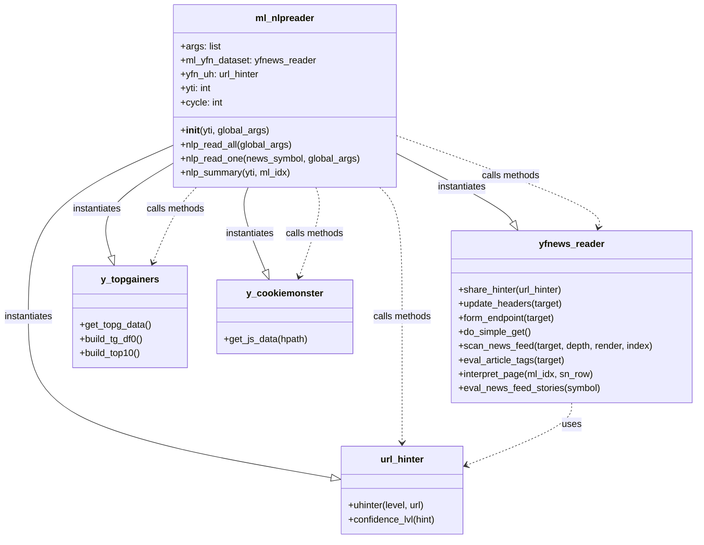

# ml_nlpreader Mermaid Diagram

This diagram visualizes the classes and their relationships in the `ml_nlpreader.py` file.

### Class Descriptions:

*   **ml_nlpreader**: The main class that orchestrates the process of reading and analyzing news articles. It uses instances of other classes to fetch data, get URL hints, and handle cookies.
*   **yfnews_reader**: Responsible for reading news from Yahoo Finance. It interacts with `url_hinter` to analyze URLs.
*   **url_hinter**: Provides hints and confidence levels for URLs to help classify them.
*   **y_topgainers**: Fetches data about top-gaining stocks.
*   **y_cookiemonster**: Manages cookies for web scraping sessions.